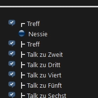

# TS3-Query-Tool
Adaptive channel creation Tool based on the TS Query API from [TheHolyWaffel](https://github.com/TheHolyWaffle/TeamSpeak-3-Java-API)

Its configured via a XML file and runs with Java 8 and up.
The additional channels are created as semi-permanent Chanel's and have the same properties

Installation Instructions:
* Download the latest [release](https://github.com/ChrisC132/Adaptive-Channels-for-TS3-Servers/releases)
* Set all needed Channels and parameters in the XML
* Run it in a screen and forget about it

If you have any problems or suggestions feel free to contact us!
